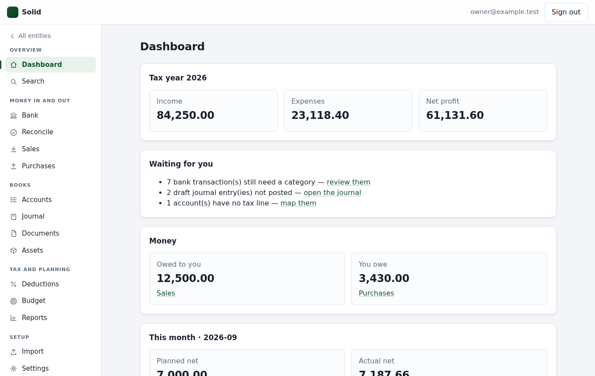
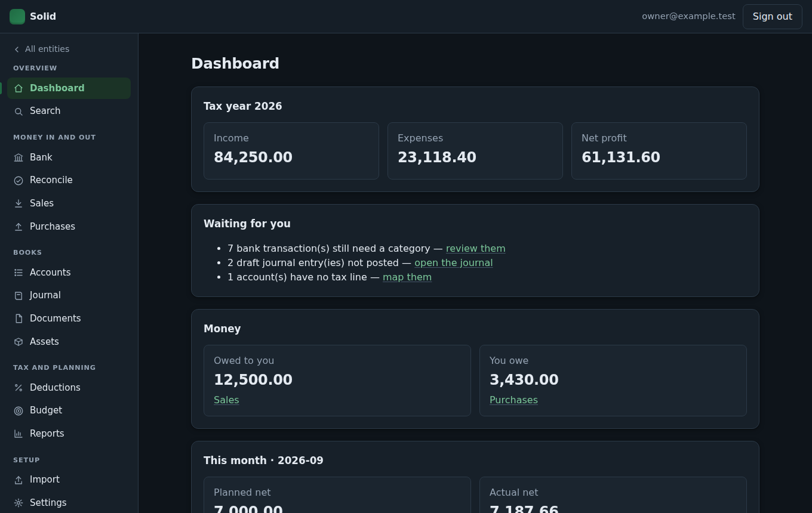
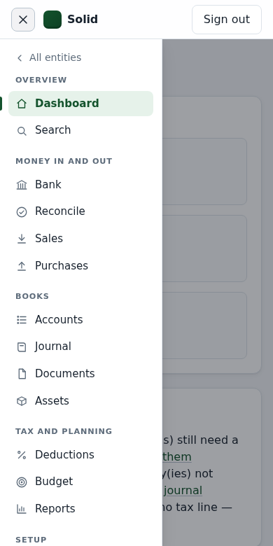

# Solid — Business & Personal Accounting + US Tax

An all-in-one, **self-hosted** accounting platform for small businesses, sole proprietors, and households,
built by **AE Software Solutions**.

> **Status:** The books are built and tested. Tax *preparation* is not: Solid keeps the books, maps them to
> tax lines and hands your preparer a clean report. Nothing here is tax advice.

## Screenshots



| Dark mode | On a phone |
|---|---|
|  |  |

*Sample data. Dark mode follows the computer's own setting; below 900px wide the menu becomes a slide-out drawer.*

## What works today

Sign in (with two-factor), create an organization and its entities, and:

| Area | What you can do |
|---|---|
| **Books** | Chart of accounts from a template (Schedule C or household), journal entries, recurring entries, opening balances, period locks, immutable posting with a hash-chained audit trail |
| **Bank** | Import CSV/OFX/QFX, review queue with rules and bulk categorizing, statement reconciliation, receipts attached to transactions |
| **Sales** | Customers, quotes (with expiry and watermarks on non-payable states), quotes-to-invoices, invoices with PDFs, credit notes with correct tax reversal, statements, payments, A/R aging |
| **Purchases** | Vendors, bills, payments, A/P aging, 1099-NEC candidate tracking |
| **Assets & deductions** | Fixed assets with straight-line depreciation and disposal, mileage log, home-office declaration |
| **Planning** | Cash-flow schedule from due dates and repeating templates, with the lowest point called out |
| **Business lines** | Tag invoices, bills, bank transactions and journal lines with a facet of the business and see the profit & loss per facet — tax lines unchanged ([spec 069](docs/specs/069-business-lines.md)) |
| **Personal** | Household chart of accounts, monthly budgets, budget vs actual |
| **Documents** | An encrypted vault for receipts and paperwork, linked to the records they support; letterhead per entity (logo, address, payment instructions) |
| **Reports** | Trial balance, P&L, balance sheet, tax-line report with a readiness check, year-end checklist, full CSV export |
| **Operations** | Backups and a restore drill, a master-key guard that refuses to start against the wrong key, per-address sign-in attempt limiting, a generated OpenAPI document |
| **Desktop** | One double-click installer per platform (`.msi`, `.dmg`, `.deb`) bundling Java and real PostgreSQL, loopback-only, single-instance — see [docs/desktop.md](docs/desktop.md) |
| **Local AI** | Category suggestions from a model on your own machine (off by default), and an MCP server in `mcp/` so a local LLM agent can read the books and perform a small set of safe writes — see [mcp/README.md](mcp/README.md) |

See `docs/specs/README.md` for the slice-by-slice history, each with acceptance criteria,
and `CHANGELOG.md` for release-level changes.

## Running it

On a server, for a household, a business or a firm with several people:

```bash
cp .env.example .env          # then set SOLID_MASTER_KEY (openssl rand -base64 32)
docker compose up --build     # http://localhost:8080
```

On one computer, for one person, there is an installer instead — a `.msi`, `.dmg` or `.deb` that carries its
own Java and its own PostgreSQL, needs neither installed, and listens only to that machine. Build it with
`ops/desktop/build.sh` (or `build.ps1` on Windows), or run the **Desktop installers** workflow.
**[docs/desktop.md](docs/desktop.md)** covers both.

The first account created becomes the instance administrator. Read **[docs/operations.md](docs/operations.md)**
before you put real books in it — especially the part about keeping `SOLID_MASTER_KEY` somewhere other than your
backups, because without it the encrypted documents cannot be read, by anyone, ever.

## Developing

```bash
cd backend && ./mvnw verify   # needs Docker running — tests boot a real PostgreSQL 16 (Testcontainers)
cd frontend && npm test
cd mcp && npm install         # the agent-facing MCP server has its own package
```

Build-checks worth knowing before you change anything:

- `./mvnw -Plicense-check verify` fails the build on disallowed dependency licenses. The policy list and its
  known open questions are discussed in the licence notes in `docs/specs/065-fourth-review-fixes.md`.
- Backend test classes must end in `Tests` (e.g. `MoneyPropertyTests`) — Maven Surefire silently skips anything
  else, so a well-named test file is how a regression test actually runs.
- A desktop build is `mvn -Ddesktop.os=linux|macos|macos-arm|windows package` in `backend/` (needs the frontend
  built first); it adds that platform's PostgreSQL binaries and serves the web UI from the jar.
- The API is documented at `/swagger-ui/index.html` on a running server;
  **[docs/api.md](docs/api.md)** shows how to script against it, and `mcp/` wraps it for LLM agents.
- Deploy target behaviour lives in `ops/deploy/auto-deploy.sh`: the deploy checkout is hard-reset to
  `origin/main`, so everything machine-specific belongs in that machine's `.env`.

## The rules this codebase keeps

- **Money is never a float.** Integer minor units in the database, `Money` in Java, decimal strings in JSON.
- **Tax figures are never invented.** Every rate, limit and threshold lives in a data file with its source; a
  year with no published figure is reported as unknown rather than guessed (`/api/v1/tax/rule-coverage`).
  Operators can supply newly announced figures at runtime, each with its source.
- **Posted entries are immutable.** Corrections are reversing entries, enforced by the database.
- **Every organization's data is isolated** by PostgreSQL row-level security — tested, including under the
  desktop build's bundled database.
- **Nothing is posted on a timer** and no figure ever comes from a language model.

## Key decisions

| Topic | Decision | Doc |
|---|---|---|
| Delivery | Self-hosted per client (Docker Compose on a VPS), plus a one-installer desktop build | [ADR-0001](docs/adr/0001-self-hosted-with-services-hub.md), [docs/desktop.md](docs/desktop.md) |
| Jurisdictions | US federal + all states; architecture ready for other countries | [Requirements](docs/design/01-requirements.md) |
| Stack | Java 21 + Spring Boot, PostgreSQL 16, React 19 + TypeScript + Vite | [ADR-0002](docs/adr/0002-tech-stack.md) |
| Ledger | Immutable double-entry journal, integer minor units | [ADR-0003](docs/adr/0003-ledger-model.md) |
| Tax rules | Declarative, versioned tax-year rule packs | [ADR-0004](docs/adr/0004-tax-rules-engine.md) |
| E-file | Later phase | [ADR-0005](docs/adr/0005-efile-via-hub.md) |
| AI | Local-first (Ollama); cloud models opt-in only | [ADR-0006](docs/adr/0006-ai-local-first.md) |

## Repository map

```
docs/
  research/     Market, tax landscape, regulation, technology options
  design/       Requirements, architecture, data model, API, tax engine, security, roadmap
  adr/          The decisions above, with their reasoning
  specs/        One spec per slice, with acceptance criteria and status
  operations.md Backups, restore drill, upgrades
  desktop.md    The one-computer install, for users and builders
  api.md        Using the API from a script
backend/        Java 21, Spring Boot, Spring Modulith, Flyway, PostgreSQL 16
frontend/       React 19 + TypeScript + Vite; one stylesheet, themeable via CSS variables (dark mode included)
mcp/            MCP server for LLM agents (Node, stdio; read-mostly tool set)
ops/            backup.sh, restore.sh, smoke-test.py, deploy/, desktop/ (installer builds)
business/       How AE Software Solutions is organized — one folder per business facet (public: no client data)
LICENSE         Proprietary — see the file
SECURITY.md     How to report a vulnerability
CHANGELOG.md    Release notes
```

## What is deliberately not here yet

Tax **calculation** and filing: projections, 1040 and its schedules, state returns, e-file, and sales-tax
filing. Those need reviewed rule packs and, for filing, IRS registration — the roadmap in
[docs/design/07-roadmap.md](docs/design/07-roadmap.md) lays out the order. Until then Solid's honest claim is
that it keeps good books and hands your preparer a clean, sourced report.

## License

Proprietary — purchase-gated use; redistribution and hosted resale are not permitted. See
[LICENSE](LICENSE). Bundled open-source components (the PostgreSQL server, the Java runtime and others)
remain under their own licenses, listed in `ops/desktop/resources/THIRD-PARTY-NOTICES.txt`, which ships inside
every installer.
