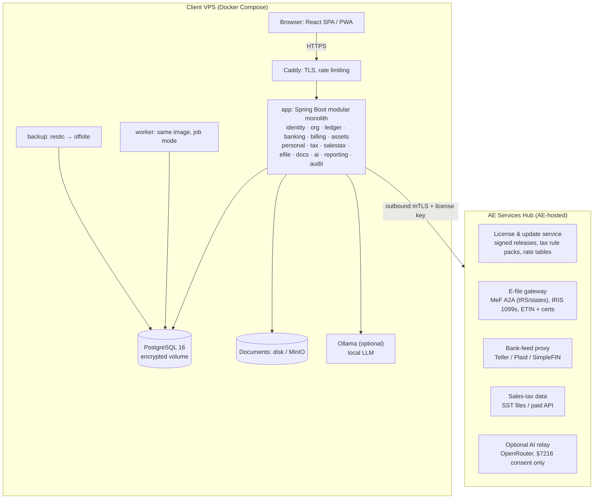

# 02 — High-Level Architecture

## 1. Big picture

Two deployables:

1. **Solid Instance** — the product. Self-hosted per client (or AE-managed). Holds all financial & taxpayer data.
2. **AE Services Hub** — run by AE Software Solutions. Holds *no books*; brokers things that can't or shouldn't live in each install.



## 2. Why a modular monolith

- One deployable is dramatically easier to self-host and upgrade on a VPS than microservices.
- Modules have strict boundaries (separate Java packages, own DB schema, public interfaces only) so any could be split out later.
- Enforce boundaries with **Spring Modulith** or ArchUnit tests.

## 3. Modules

| Module | Responsibility | Owns tables (schema) |
|---|---|---|
| `identity` | Users, MFA, sessions, roles, API keys | `iam` |
| `org` | Organizations, entities, ownership graph | `org` |
| `ledger` | COA, journal, periods, balances, tax-line mapping | `gl` |
| `banking` | Connections, imports, bank transactions, reconciliation, rules | `bank` |
| `billing` | Customers, vendors, invoices, bills, payments, 1099 vendor tracking | `ar_ap` |
| `assets` | Fixed assets, depreciation schedules | `fa` |
| `personal` | Budgets, holdings, lots, tax documents (W-2/1099 received) | `pf` |
| `tax` | Rule-pack runtime, returns, projections, estimates, carryforwards, forms | `tax` |
| `salestax` | Nexus, jurisdictions, rates, liabilities | `stx` |
| `efile` | Build MeF/IRIS payloads, submit via Hub, track acks | `efile` |
| `docs` | File storage, OCR/extraction, links to records | `doc` |
| `ai` | Categorization & extraction orchestration (Ollama / Hub relay) | `ai` |
| `reporting` | Financial statements, exports | (read models) |
| `audit` | Append-only audit log | `audit` |
| `platform` | Jobs, notifications, settings, updates, backups | `sys` |

## 4. Key data flows

### 4.1 Bank transaction → books → tax
```
Bank feed/OFX → bank.transaction (raw) → categorization (rules → AI) → user confirms
  → ledger.post(JournalEntry) → account balances → tax-line rollup (Schedule C line X)
  → tax projection recompute (async job, debounced) → dashboard "estimated tax owed"
```

### 4.2 Business → owner flow-through
```
LLC (S-corp) books → 1120-S return → K-1 per owner (ownership %)
  → owner's 1040: Schedule E part II + QBI (8995) → state returns
```
Ownership graph lets us recompute the owner's personal projection whenever the business books change.

### 4.3 Return preparation & e-file
```
Tax year rule pack (signed) → Fact store (answers + ledger-derived facts + imported docs)
  → Engine evaluates graph → Form values + diagnostics + explanation trace
  → Review/sign (8879) → efile module builds MeF XML, validates vs XSD + business rules
  → POST to Hub (mTLS) → Hub queues → IRS MeF A2A → ack polled → status back to instance
```

## 5. Instance ↔ Hub contract

- Instance initiates **all** connections (no inbound ports needed besides HTTPS for users).
- Authentication: instance license key + per-instance client certificate (mTLS).
- Payloads containing tax data are encrypted end-to-end to the Hub e-file service; Hub stores submissions only as long as the IRS requires for transmitters, then purges.
- Hub endpoints are versioned (`/v1/...`) and backward compatible for ≥2 app versions, since clients upgrade at their own pace.
- Rule packs and rate tables are **signed** (e.g., Sigstore/minisign); instance verifies signature before install.

## 6. Deployment (client VPS)

`docker-compose.yml` services: `caddy`, `app`, `worker`, `postgres`, `minio` (optional, default local disk), `ollama` (optional profile), `backup`.

- Installer script: checks resources, generates secrets, sets domain, obtains TLS, enables firewall (ufw), creates first admin with MFA.
- Upgrades: `solid upgrade` → pull signed image → pre-upgrade backup → Flyway migrations → health check → automatic rollback on failure.
- Backups: nightly encrypted `pg_dump` + documents via restic to client-chosen offsite storage; restore drill in admin UI.

**Hostinger VPS sizing guide (initial guess, validate with load tests):**

| Tier | Use | Spec |
|---|---|---|
| Small | 1 household / 1–3 entities, no local AI | 2 vCPU, 4 GB |
| Medium | Small firm, local AI with small model | 4 vCPU, 16 GB |
| Large | Firm with 100+ orgs, vision models | 8 vCPU, 32 GB (+GPU if available) |

## 7. Caching, jobs & events

- **Caching:** Postgres materialized balance tables updated transactionally; Caffeine in-process cache for rule packs and COA. No Redis in v1.
- **Jobs:** Postgres-backed queue (JobRunr or `SKIP LOCKED` pattern) — bank sync, AI extraction, tax recompute, report exports, e-file polling.
- **Domain events:** in-process (Spring Modulith events with transactional outbox) e.g. `JournalPosted` → `TaxProjectionStale`, `ReconciliationCompleted`.
- **Retries:** exponential backoff with jitter; idempotency keys on every external call (bank feeds, Hub submissions); dead-letter table surfaced in admin UI.

## 8. Monitoring

- Instance: `/actuator/health`, Prometheus metrics, structured JSON logs; optional opt-in anonymous health ping to Hub (no financial data).
- Hub: uptime monitoring, e-file queue depth & ack latency alerts, rejection-rate alerts, certificate expiry alerts, filing-season on-call.

## 9. What we'd revisit as we grow

| Trigger | Change |
|---|---|
| Many managed installs on AE VPSes | Offer true multi-tenant SaaS (schema-per-tenant or RLS) using the same code |
| Heavy report queries | Read replica / columnar warehouse for analytics |
| E-file volume in peak season | Split Hub e-file gateway into its own horizontally scaled service |
| Real-time collaboration needs | WebSockets / SSE |
| Payroll | Separate bounded context or partner integration |
